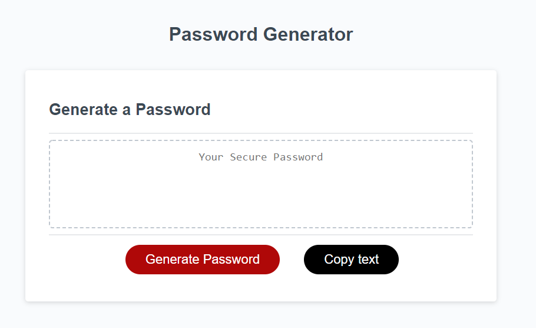

Welcome to my [password generator project](WEBSITE). 

**Project Code:**

1. Index.HTML: Very basic layout with a button and an output field
1. Script.JS: A script that takes user criteria and presents a randomly generated password. User selects # of character and uppercase, lowercase, special character, or number. The algorithm generates a minimum of 1 of each character type selected, and then randomly selects the character and character type for the rest of the characters.
1. style.CS: Basic styling for the page

